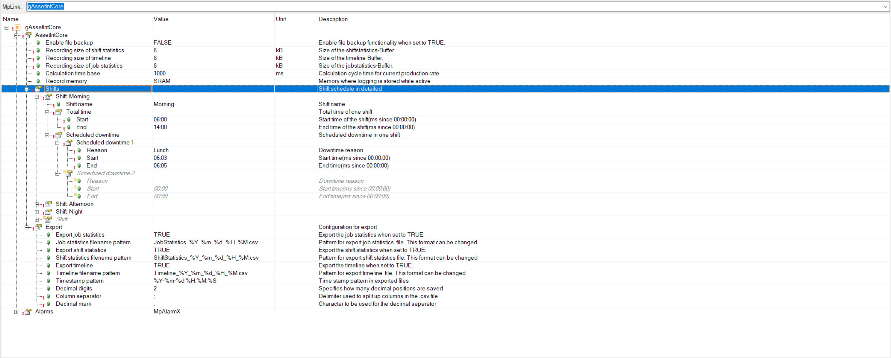
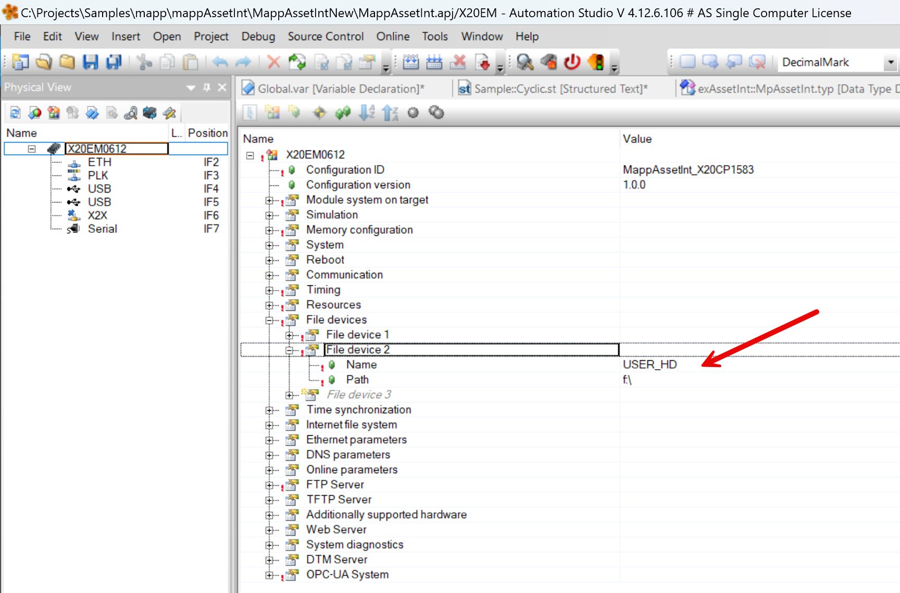
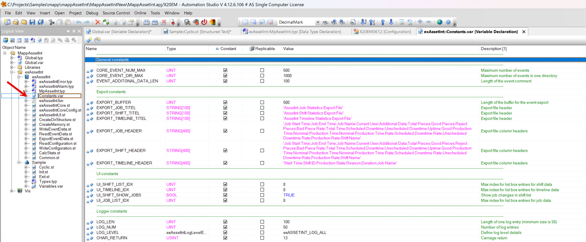

This guide provides details how to convert the official mappAssetInt package to the community version.

### Installation
The fastest way to convert the official mappAssetInt package to a community version is to use the package from the sample as a template. Copy the package "exAssetInt" into your project.

### Transfer existing configuration
Open the assetInt configuration in the configuration view. Everything above "Shifts" can be ignored. Write down the shift details.

Open the sample task and transfer the shift details into the init section of the task. The example uses an additional structure for the shift data for better integration into visual components. The cyclic tasks then translates this data into the configuration structure. The data can also be entered into the configuration structure (exAssetIntConfig.Shifts[]) directly as "Time Of Day" value.

    // ---------------------------------------------------------------------------------------------
    // Shift configuration
	gShift[0].Name := 'Morning';
	gShift[0].Start.Hour := 8;
	gShift[0].Start.Minutes := 0;
	gShift[0].End.Hour := 14;
	gShift[0].End.Minutes := 0;
	gShift[0].ScheduledDowntime[0].Reason := 'Breakfast';
	gShift[0].ScheduledDowntime[0].Start.Hour := 9;
	gShift[0].ScheduledDowntime[0].End.Hour := 9;
	gShift[0].ScheduledDowntime[0].End.Minutes := 15;

	gShift[1].Name := 'Afternoon';
	gShift[1].Start.Hour := 14;
	gShift[1].Start.Minutes := 0;
	gShift[1].End.Hour := 22;
	gShift[1].End.Minutes := 0;

	gShift[2].Name := 'Night';
	gShift[2].Start.Hour := 22;
	gShift[2].Start.Minutes := 0;
	gShift[2].End.Hour := 8;
	gShift[2].End.Minutes := 0;

The export configuration is entered using the same structure. Export parameters are optional. You can also use the default values.

	// ----------------------------------------------------------------------------------------------
	// Export configuration
	exAssetIntConfig.Export.DecimalMark := ',';
	exAssetIntConfig.Export.ColumnSeparator := ';';

	exAssetIntConfig.Export.ShiftStatistics := TRUE;
	exAssetIntConfig.Export.ShiftStatisticsFileNamePattern := 'ShiftStatistics_%Y_%m_%d_%H_%M.csv';
	
	exAssetIntConfig.Export.JobStatistics := TRUE;
	exAssetIntConfig.Export.JobStatisticsFileNamePattern := 'JobStatistics_%Y_%m_%d_%H_%M.csv';

	exAssetIntConfig.Export.Timeline := TRUE;
	exAssetIntConfig.Export.TimelineFileNamePattern := 'Timeline_%Y_%m_%d_%H_%M.csv';

### Additional configuration
The only mandatory additional configuration is the device name. Since the community version uses the flash card to store data it is necessary to enter the device name. The device name is defined under the CPU configuration under file devices.

    DeviceName := 'USER_HD';

### Optional configuration
The default configuration should work for most applications. However, the following parameters can be adjusted if necessary. For a detailed description see the [appendix](appendix.md).

### Connect the function blocks and structures to other tasks or visual components

All function blocks and variable structures have the exact same name as before. The only difference is the prefix. The prefix "Mp" was changed to "ex". For example, "MpAssetIntCore" was changed to "exAssetIntCore".

### Remove old AssetInt

To remove the old assetInt configuration delete configuration file under the configuration view. **If there is no other mappService used** you can also set the mappService to "not defined".

If there are other mappServices used, you can remove the assetInt service by deleting the library MpAssetInt.

### Addition notes

* The parameter "EnableFileBackup" is no longer required and was removed from the core config structure. The data is always stored in the flash memory.

* The parameters "SaveInterval", "RecordMemory", "RecordingSizeShiftStatistics" and "RecordingSizeJobStatistics" are no longer required and were removed from the general config structure.
