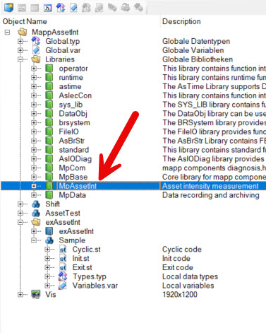
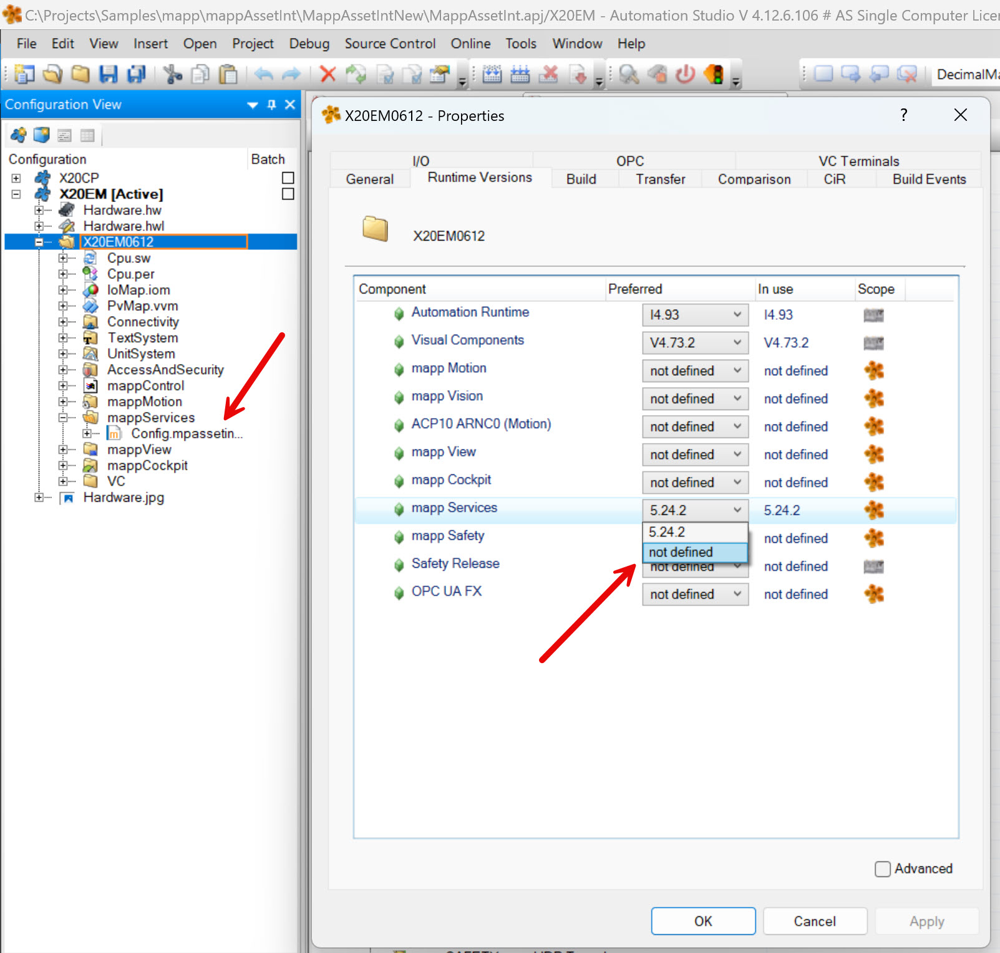

This guide provides details how to convert the official mappAssetInt package to the community version.

### Installation
The fastest way to convert the official mappAssetInt package to a community version is to use the package from the sample as a template. Copy the package "exAssetInt" into your project.

### Transfer existing configuration
Open the assetInt configuration in the configuration view. Everything above shift can be ignored. Write down the shift details.

Open the sample task and copy the shift details into the task. The data can also be entered into the variable declaration.

The same structure is used to enter the export configuration.

Export parameters are optional. You can also use the default values.

### Additional configuration
The only mandatory additional configuration is the device name. Since the community version uses the flash card to store data it is necessary to enter the device name. The device name is defined under the CPU configuration under file devices.

### Optional configuration
The default configuration should work for most applications. However, the following parameters can be adjusted if necessary. For a detailed description see the [appendix](appendix.md).

### Connect the function blocks

All function blocks and variable structures have the exact same name as before. The only difference is the prefix. The prefix "Mp" was changed to "ex". For example, "MpAssetIntCore" was changed to "exAssetIntCore".

### Remove old AssetInt

To remove the old assetInt configuration delete configuration file under the configuration view. If there is no other mappService used you can also set the mappService to "not defined".

